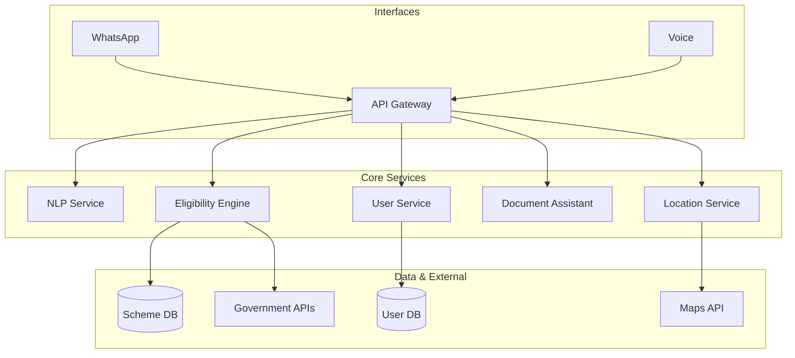

# Design Document: AI Public Service Guide

## Overview

A multilingual AI assistant that helps Indian citizens access government welfare schemes through WhatsApp and voice interfaces. The system overcomes language barriers and digital literacy challenges by providing simple, voice-first interactions in Hindi and regional languages.

Key capabilities: eligibility matching, document guidance, office location services, and fraud prevention.

## Architecture

Cloud-native microservices architecture with event-driven communication:



## Components and Interfaces

### 1. NLP Processing Service
Handles multilingual speech-to-text, text-to-speech, and intent detection for Hindi and 5 regional languages.

```typescript
interface NLPService {
  processVoice(audio: Buffer, language: string): Promise<{text: string, intent: string}>
  generateSpeech(text: string, language: string): Promise<Buffer>
  simplifyText(text: string, level: number): Promise<string>
}
```

### 2. Eligibility Engine
Matches users with government schemes based on demographics and criteria.

```typescript
interface EligibilityEngine {
  findSchemes(profile: UserProfile): Promise<EligibleScheme[]>
  checkEligibility(schemeId: string, profile: UserProfile): Promise<boolean>
  rankSchemes(schemes: EligibleScheme[]): Promise<RankedScheme[]>
}
```

### 3. WhatsApp Integration
Manages conversations through WhatsApp Business API.

```typescript
interface WhatsAppService {
  sendMessage(phone: string, message: string): Promise<void>
  handleIncoming(webhook: WebhookData): Promise<void>
}
```

## Data Models

```typescript
interface UserProfile {
  userId: string
  phoneNumber: string
  preferredLanguage: string
  demographics: {
    age: number
    category: 'General' | 'OBC' | 'SC' | 'ST' | 'EWS'
    occupation: string
    monthlyIncome: number
  }
  location: {
    state: string
    district: string
    pincode: string
  }
}

interface GovernmentScheme {
  schemeId: string
  name: string
  description: string
  ministry: string
  eligibilityCriteria: {
    ageRange?: [number, number]
    incomeRange?: [number, number]
    categories?: string[]
    states?: string[]
  }
  benefits: string[]
  requiredDocuments: string[]
  isActive: boolean
}
```

## Correctness Properties

*Properties are formal statements about system behavior that should hold true across all valid executions.*

### Property 1: User Profile Completeness
*For any* new user, the system should collect required profile fields, validate data, and store securely.
**Validates: Requirements 1.1, 1.2, 1.4, 1.5**

### Property 2: Multilingual Voice Processing
*For any* supported language input, speech should convert to text and back to speech accurately.
**Validates: Requirements 2.1, 2.2, 2.3**

### Property 3: WhatsApp Conversation Continuity
*For any* WhatsApp conversation, context should be maintained across messages.
**Validates: Requirements 3.1, 3.2, 3.3**

### Property 4: Scheme Matching Accuracy
*For any* complete user profile, all eligible schemes should be identified and ranked correctly.
**Validates: Requirements 4.1, 4.2, 4.4**

### Property 5: Language Simplification
*For any* system response, content should use appropriate vocabulary and provide clear explanations.
**Validates: Requirements 5.1, 5.2, 5.3, 5.4**

### Property 6: Document Assistance Completeness
*For any* selected scheme, complete document requirements and guidance should be provided.
**Validates: Requirements 6.1, 6.2, 6.3, 6.4**

### Property 7: Location Service Accuracy
*For any* location request, the 3 nearest offices with complete information should be returned.
**Validates: Requirements 7.1, 7.2, 7.3**

### Property 8: Timely Notifications
*For any* deadline or scheme update, notifications should be sent at correct intervals.
**Validates: Requirements 8.1, 8.2, 8.3**

### Property 9: Fraud Detection
*For any* suspicious activity, appropriate warnings and education should be provided.
**Validates: Requirements 9.1, 9.2, 9.3**

### Property 10: Bandwidth Adaptation
*For any* low-bandwidth scenario, the system should adapt responses appropriately.
**Validates: Requirements 10.1, 10.2, 10.3, 10.4**

## Error Handling

- **Network Issues**: Graceful degradation to text-only mode, offline caching
- **Language Processing**: Confidence thresholds, fallback languages
- **Data Validation**: Input sanitization, guided error correction
- **External Services**: Retry logic, cached fallbacks
- **Security**: Encrypted storage, breach detection

## Testing Strategy

**Unit Tests**: Specific examples, edge cases, integration points
**Property Tests**: Universal correctness using fast-check library (100+ iterations)
**Integration Tests**: End-to-end WhatsApp flows, government API integration
**Performance Tests**: Load testing for peak usage scenarios

Each property test tagged as: **Feature: ai-public-service-guide, Property {number}: {description}**
